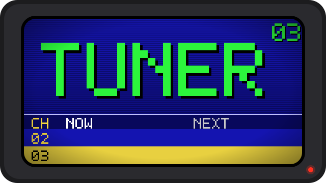
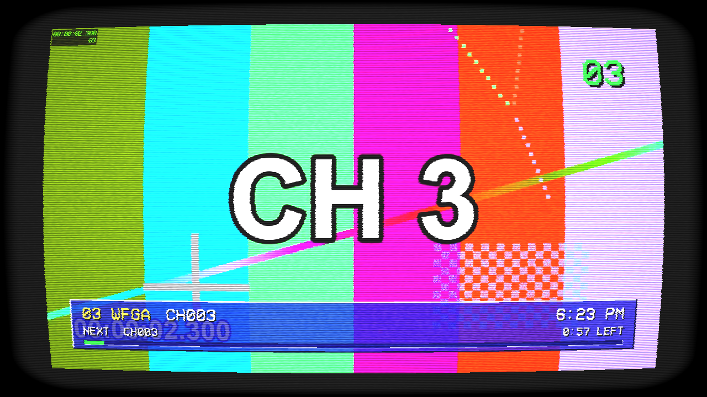
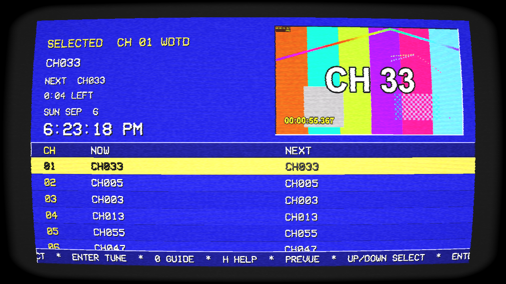
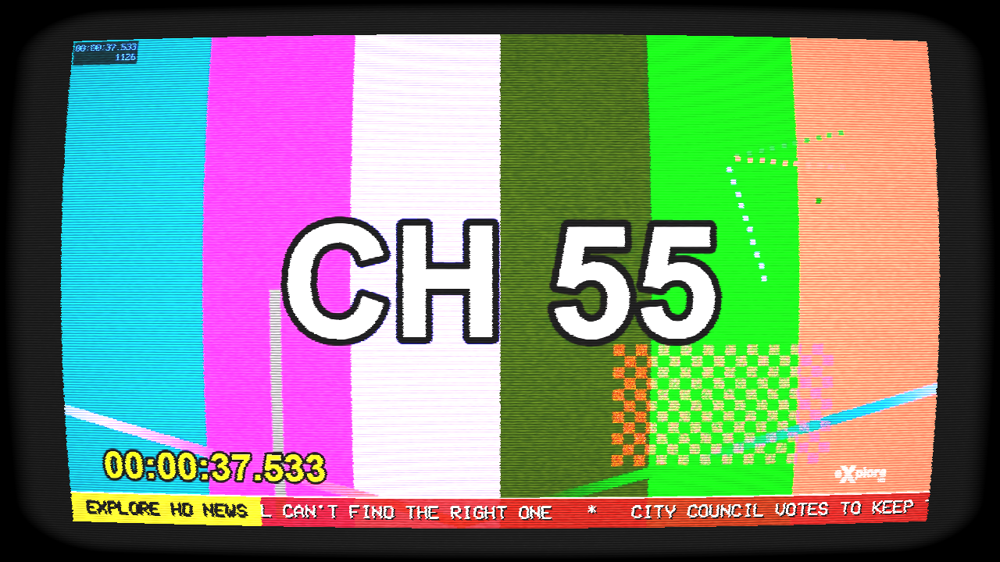
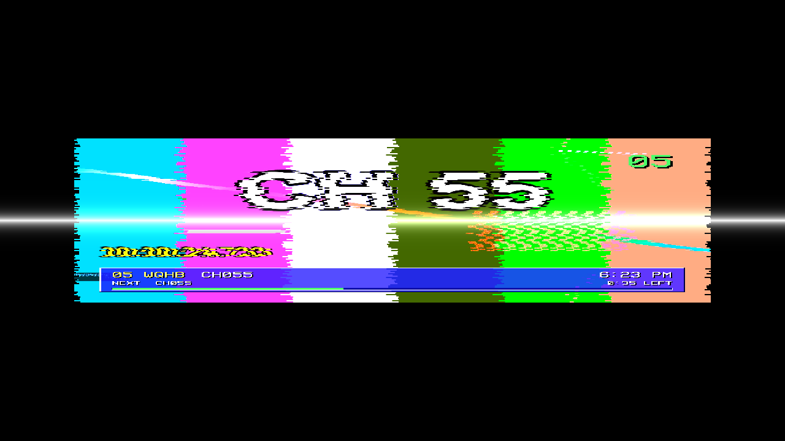
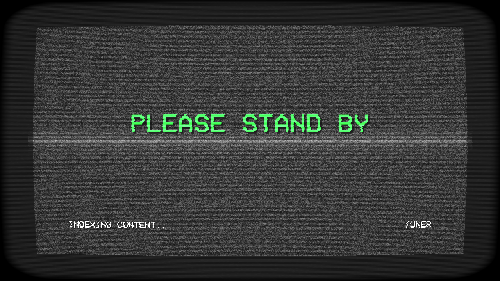
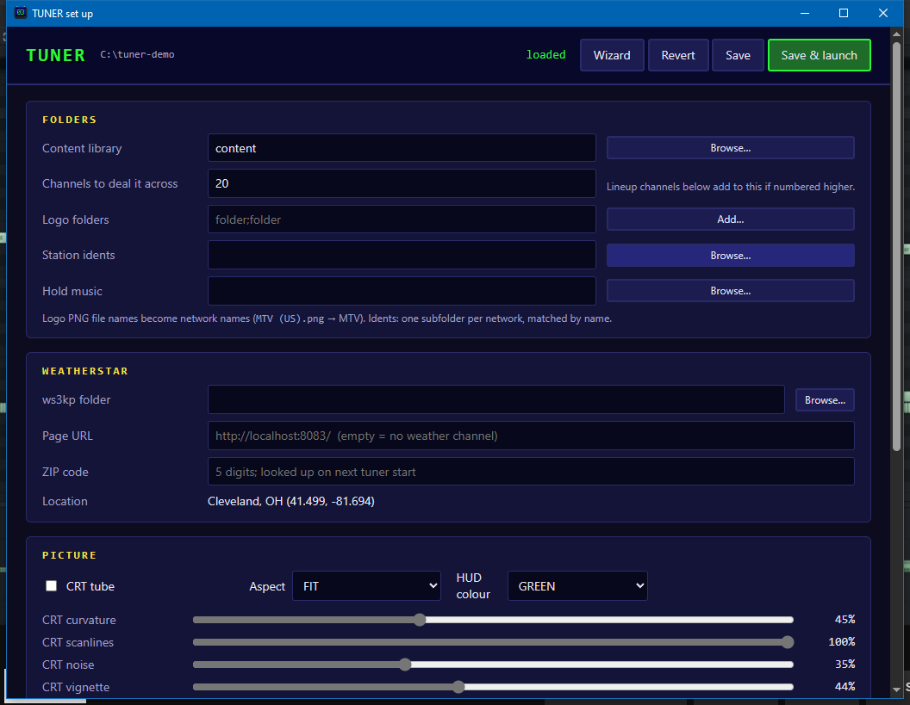
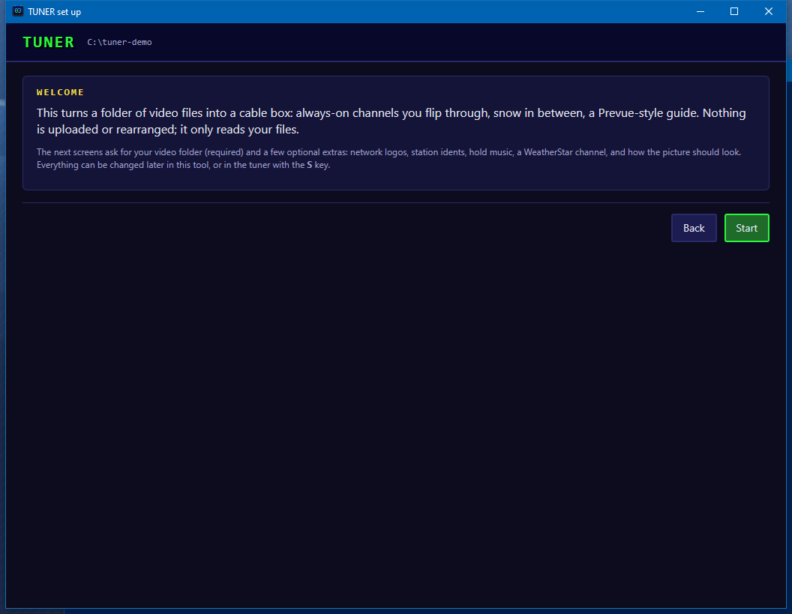

<p align="center"></p>

# tuner

A 90s cable box for a folder of video files.

Point it at a directory and it deals the files across N always-on channels, each a looping
playlist whose position is a pure function of wall-clock time. You don't pick what to watch, you
flip channels: snow, a hiss, a lock-in wobble, and you're on whatever is playing right now.
Channel 0 is a Prevue-style channel with a scrolling grid, a preview box and hold music; G opens
the same grid as an interactive guide.

Tuning is instant. Every channel owns a demuxer + decoder pipeline that background workers keep
primed at the keyframe just before "now", so a channel change is a pointer swap plus one frame.
Rust + FFmpeg. On Windows video decodes through D3D11VA and is presented with a Direct3D 11
shader; on Linux it decodes in software and is presented through wgpu (Vulkan, OpenGL fallback).
The CRT pass is optional on both.

<p align="center"></p>
<p align="center"></p>
<p align="center"></p>

## The set-top-box experience

- **Snow between channels.** Picture and sound go to static the instant a key is pressed and stay
  there until the new channel has a frame, then the picture rolls once and the horizontal hold
  hunts for half a second before it locks.
- **Tube warm-up.** On launch the raster opens from a white-hot line over a PLEASE STAND BY card
  while the library is indexed (the window is up at once, even on a slow network share); Esc
  collapses it back.
- **TV-set OSD.** Big green channel number top right, in the VCR OSD Mono font, aliased with a
  drop shadow. Typed digits show as `3-` until they commit.
- **Cable-box banner.** Channel number, network, what's on, what's next, time left, a
  progress bar and the clock, on a translucent bevelled bar. Comes up on every tune, or on Enter.
- **Volume and MUTE.** Twenty green segments. MUTE blinks in the corner while it's on.
- **Recall.** Backspace jumps to the previous channel.
- **Prevue channel.** Channel 0 is a blue Prevue grid with alternating rows, a clock and date, a
  preview box that rotates through the channels, and a ticker along the bottom. It scrolls on its
  own and isn't interactive, like the real thing: arrows change channel, Enter watches the preview.
- **Interactive guide.** G opens the same grid with a cursor. Up/Down move it (the preview box
  and its audio follow), Left/Right jump ten, Enter tunes, G closes. Hold music only plays on the
  Prevue channel.
- **CRT pass.** Phosphor triads, scanlines, interference, barrel curvature, vignette, rounded
  bezel. Toggle with C; curvature, scanline depth, noise and vignette are tunable in the menu.
- **Channels dress their picture.** Every channel is assigned a network from your logo folders
  (fixed per channel number). About half show a translucent logo bug in a corner, a quarter run a
  small clock, a fifth run a lower-third news crawl with headlines from `assets/headlines.txt`.
- **Station idents.** A bumper from `<idents folder>\<Network>\` plays between programs, matched to
  the channel's network folder when one exists. The guide and banner skip idents when saying what's on.
- **WeatherStar 3000.** The last channel is a local [ws3kp](https://github.com/netbymatt/ws3kp)
  page in a WebView2 child window: tuner starts the Node server itself and points the page at
  your ZIP. Snow, then the forecast.
- **Set up menu (S).** Black VCR-style menu: CRT tube and its four knobs, overscan/underscan,
  aspect (FIT / 4:3 / 16:9 / STRETCH), HUD colour, logos, clocks, ticker, idents, snow, hold
  music, 24-hour clock, and a WEATHER ZIP row you type digits into. Saved to
  `tuner_settings.json` next to the exe.

<p align="center"></p>
<p align="center"></p>

## Remote

| Key | Action |
| --- | --- |
| Up / Down | Channel +1 / -1 (interactive guide: move cursor) |
| Left / Right | Channel +10 / -10 (interactive guide: cursor +10 / -10) |
| 0-9 | Direct tune; commits after the last digit or 1.5 s. `0` is the Prevue channel |
| Enter | Info banner; Prevue channel: watch the preview; interactive guide: tune the cursor row |
| Backspace / R | Recall last channel |
| + / - | Volume |
| M | Mute |
| G | Interactive guide (again to close) |
| I | Info banner |
| S | Set up menu (Up/Down row, Left/Right change, digits + Enter on WEATHER ZIP) |
| C | CRT pass |
| H / F1 | Remote legend |
| Esc | Power off |

## Running

Double-click `tuner.exe` (or "Save & launch" in `tuner-setup.exe`) and it runs from
`tuner_settings.json` and `tuner_lineup.json` with no console window. Command-line flags override
the settings and keep the console for logs:

```
tuner [<dir>] [--channels N] [--music DIR] [--crt] [--sw] [--start N] [--bench N] [--shot MS]
```

| Flag | Meaning |
| --- | --- |
| `<dir>` | Folder of video files (default: `content_dir` from settings). Probed once, cached in `tuner_index_v2.json` |
| `--channels N` | Number of channels to deal the files across (default: `channels` from settings) |
| `--music DIR` | Folder of audio files for the guide's hold music (default: `music_dir` from settings) |
| `--crt` | Start with the CRT pass on |
| `--sw` | Software decode instead of hardware (D3D11VA on Windows; Linux is always software) |
| `--start N` | Channel to start on (default 1) |
| `--bench N` | Automated random tunes at key-repeat speed, then print latency stats and exit |
| `--shot MS` | Dump one frame to `bench_last.ppm` after MS milliseconds and exit |

`gen_content.sh [N] [DUR]` renders N test channels (colour bars with a channel number and clock)
into `content/` with ffmpeg, for trying it without a library.

### tuner-setup.exe

A windowed editor for everything below, with folder-browse dialogs, plus a **channel lineup**
table: give any channel number a name, a logo from your logo folders, its own source folders
(played shuffled or A→Z), and dressing overrides (bug corner, clock, ticker, which ident folder).
Channels you don't list are dealt from the content library as usual. "Save & launch" starts the
tuner. It writes `tuner_settings.json` and `tuner_lineup.json` next to the exes.

<p align="center"></p>

On a first run (no `tuner_settings.json` yet) `tuner.exe` opens this tool as a step-by-step wizard
(`tuner-setup.exe --wizard`); the Wizard button brings it back any time.

<p align="center"></p>

### tuner_settings.json

Written next to the exe on first run; everything in the set up menu lives here, plus paths the
menu doesn't edit:

| Key | Meaning |
| --- | --- |
| `logo_dirs` | `;`-separated folders of PNG network logos. The file stem is the network name (`MTV (US).png` is `MTV`) |
| `bumper_dir` | Folder tree of idents, one subfolder per network. Subfolders without a logo still become networks |
| `weather_dir` | A ws3kp checkout; `node index.mjs` is started there on launch. Empty = don't start one |
| `weather_url` | Where the WeatherStar page is served. Empty = no weather channel |
| `weather_zip` | Set from the menu; looked up via zippopotam.us into `weather_lat`/`weather_lon`/`weather_location` |

For the weather channel: `git clone https://github.com/netbymatt/ws3kp` somewhere, `npm install`
in it, and point `weather_dir` at it. Needs Node and the WebView2 runtime (ships with Edge).

Esc or closing the window prints tune-latency percentiles (keypress to first presented frame).

## Installing a release

Unzip `tuner-<version>-win64.zip` anywhere and double-click `TUNER.exe`: on first run it opens the
set up wizard to pick your video folder and the optional extras. `TUNER Setup.exe` reopens the
editor. Both are small launchers for `bin\tuner.exe` and `bin\tuner-setup.exe`, which sit in
`bin\` with the FFmpeg DLLs; settings are written there too (or under `%LOCALAPPDATA%\tuner` if
that folder is read-only). Requirements: Windows
10 or later and a Direct3D 11 GPU. Linux: `tuner-<version>-linux-x86_64.tar.gz`, needs the distro's
FFmpeg shared libraries and Vulkan or OpenGL drivers. Optional on Windows: the WebView2 runtime (ships with Edge) for
`tuner-setup.exe` and the weather channel, and Node.js for the weather channel's local server.

If something goes wrong at startup the tuner shows a dialog and writes `tuner_crash.log` next to
the exe. A second double-click while it's running does nothing (single instance).

`dist.ps1` builds that zip from a checkout.

## Building

Windows is the primary target (Direct3D 11 presenter, D3D11VA zero-copy decode). Linux builds use
a wgpu presenter (Vulkan, OpenGL fallback) with software decode; see below.

- Rust stable
- FFmpeg 6.x **shared** build (e.g. BtbN `ffmpeg-n6.1-win64-gpl-shared`), path in `FFMPEG_DIR`
- LLVM/libclang for `ffmpeg-next`'s bindgen, path in `LIBCLANG_PATH`

Copy `.cargo/config.windows.toml` to `.cargo/config.toml` and edit the two paths for your machine (the copy is
gitignored; Linux builds must not have it, they use pkg-config). `build.rs` copies the
FFmpeg DLLs next to the exe so `cargo run --release` works without touching `PATH`.

```
cargo build --release
.\target\release\tuner.exe D:\videos --channels 40 --crt
```

Three binaries come out: `tuner.exe`, `tuner-setup.exe`, and `launcher.exe` (the stub `dist.ps1`
copies to the top of the zip as `TUNER.exe` / `TUNER Setup.exe`).

### Linux

The tuner itself builds and runs on Linux with the wgpu renderer. Not there yet: the WeatherStar
channel and `tuner-setup` (both need WebView2), hardware decode (VAAPI), and idle-drag handling
is simply not needed. Edit `tuner_settings.json` / `tuner_lineup.json` by hand (the tuner writes
defaults on first run next to the binary, or under `~/.config/tuner`).

Debian / Ubuntu prerequisites:

```
sudo apt install build-essential pkg-config clang libclang-dev   libavcodec-dev libavformat-dev libavutil-dev libswresample-dev libswscale-dev   libavdevice-dev libavfilter-dev libasound2-dev libvulkan-dev mesa-vulkan-drivers   libxkbcommon-dev libwayland-dev libx11-dev
curl https://sh.rustup.rs -sSf | sh
./build-linux.sh                 # or: cargo build --release (sets LIBCLANG_PATH for you)
./target/release/tuner /path/to/videos --channels 40
```

Built and run on Ubuntu 22.04 (FFmpeg 4.4) through WSLg; FFmpeg 4.4 through 7.x are supported.

On Windows the same renderer can be forced for testing with `cargo build --release --features
wgpu-render`.

## How it works

- **Schedule.** Files are shuffled deterministically and dealt round-robin into channels. Each
  channel is a loop of its files; `(now + ch * 997) mod loop_length` says what's on and how far
  in. Restart the app and every channel is where it would have been.
- **Priming.** Worker threads keep every idle channel's pipeline seeked to the keyframe before
  "now" with that frame already decoded. The two neighbours of the current channel are kept fully
  caught up (video and audio at the schedule point) so Up/Down is frame-exact with sound queued.
- **Tune.** The UI thread puts snow up and sends one message. The decode thread hands its
  pipeline back to the slot, takes the target's, ships the primed frame. No file I/O or decoder
  setup on the hot path; a cold open only happens if a worker hadn't reached that channel yet.
- **Presenting.** One HLSL pass does NV12/yuv420p to RGB, letterboxing, snow, the tube warm-up
  and lock-in wobble, and composites a CPU-drawn ARGB overlay (OSD, banner, guide). The CRT pass
  renders that composite through a second shader. Present is tearing-enabled and never blocks.
- **Audio.** One cpal output stream fed from a ring; the callback mixes white noise in proportion
  to the on-screen snow and applies the volume/mute gain.
- **Networks and idents.** Logo PNGs are decoded once and box-filtered to size on first use.
  Idents are probed like library files and appended with a `bumper` flag; the schedule builder
  inserts one after every program, so "now/next" walks past them.
- **Weather.** The weather channel has an empty schedule; tuning it parks the decode thread and
  shows the WebView2 control (a child HWND, so it paints above the D3D11 swapchain and outside the
  CRT pass). The Node server is a child process killed on exit.

Font: [VCR OSD Mono](https://www.dafont.com/vcr-osd-mono.font) by Riciery Leal.
